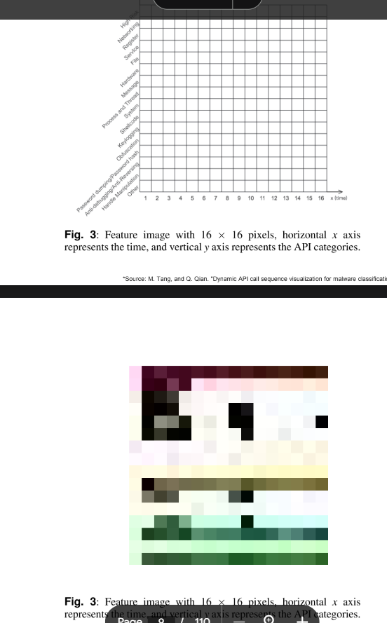

# midterm_project
## Set up with Cuckoo_installation.pdf

## Token API
```bash 
#to find his token to call api
cat ~/.cuckoo/conf/cuckoo.conf
```
Then change the variable token in extract_file_csv.py

## How to extract a csv
```bash 
#clone it
cd midterm_project
python3 extract_file_csv_from_url.py <URL_VIRUS_SHARE>
#python3 extract_file_csv.py https://virusshare.com/hashfiles/VirusShare_00000.md5
```

It will create 00000.md5.csv that we will convert into an image.

I think that https://virusshare.com/hashfiles/VirusShare_00000.md5 like containts several malwares, so we maybe have to split into differents files like 00000_1.md5.csv, 00000_2.md5.csv, etc.

Sometimes the parsing fail, you will have to relaunch the program. 

## Next step 
- a program to convert information in the csv file into an image like :



